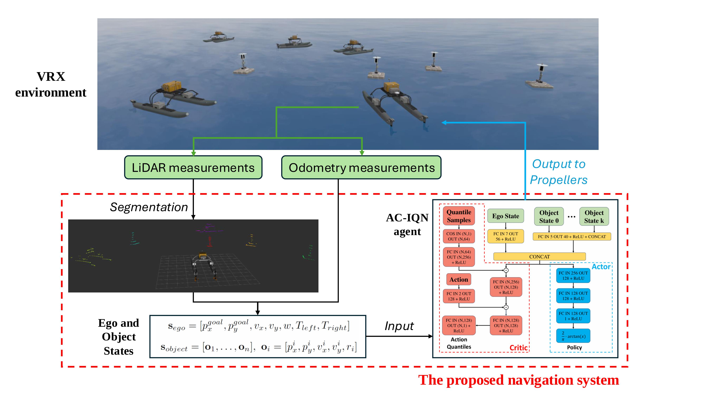

# Distributional RL Decision and Control

This repository provides the code implementation of our RA-L paper [here](https://arxiv.org/abs/2412.09466). We developed an ASV decision making and control policy based on Actor Critic Implicit Quantile Networks (AC-IQN), and integrated it into a navigation system that works in congested multi-vehicle environments, under the influence of wind and wave disturbances on ASV motion and perception. The performance of our approach is shown in the video [here](https://robustfieldautonomylab.github.io/Lin_RA-L_2024_10-FinalVideo.mp4).  

<p align="center">
 
</p>

## Preparing RL based Decision Making and Control Policies  
The preparation process of our proposed AC-IQN based policy, and all other five RL based policies described in our paper, is described as follows. You can also skip this section and run VRX experiments with the provided pretrained models.  

### 1. Train RL model
Run the following command to train RL model.
```
python train_rl_agents.py -C CONFIG_FILE [-P NUM_PROCS] [-D DEVICE]
```

Replace CONFIG_FILE with the path to the training config file. Example training config files are provided in config directory.   

-P and -D flags are optional. -P can be used to specify the number of processes to be run in parallel when training multiple models. -D can be used to specify the CPU or GPU intended to be used in training.

### 2. Evaluate Training Performance
We provide scripts for plotting learning performance and visualizing evaluation episodes of RL agents trained by you.

To plot learning curves, set data_dir, seeds, and eval_agents in plot_eval_returns.py according to the corresponding trained RL models, and run the command
```
python plot_eval_returns.py
```

To visualize an evaluation episode, set eval_id and episode_id in visualize_eval_episode.py according to the corresponding evaluation config file, and run the command
```
python visualize_eval_episode.py
```

### 3. Convert Trained model to TorchScript File
To convert a trained PyTorch model to a TorchScript file that can be used by the navigation system operating in the Gazebo environment, customize save_model_to_torch_script.py as needed, and run the following command.
```
python save_model_to_torch_script.py
```    

## Build VRX Simulation Environment
The Gazebo based simulator [VRX](https://github.com/osrf/vrx) is used for simulation experiments. We developed new packages that realize the navigation system and added them to the original simulator. The simulation envrionment can be built as follows.  

Download LibTorch from [here](https://download.pytorch.org/libtorch/cpu/) and add it to environment path. Our code implementation uses the version 2.2.1+cpu. 
```
export LD_LIBRARY_PATH=/path/to/libtorch/lib:$LD_LIBRARY_PATH
source ~/.bashrc
sudo ldconfig
```

Set "/path/to/libtorch" to the corresponding location in line 5 of vrx-2.3.2/action_planner/CMakeLists.txt:
```
list(APPEND CMAKE_PREFIX_PATH "/path/to/libtorch")
```

Navigate to the root directory of this repo and run the following commands
```
mkdir -p vrx_ws/src
cp -r vrx-2.3.2/* vrx_ws/src
cd vrx_ws
source /opt/ros/humble/setup.bash
colcon build --merge-install
. install/setup.bash
cp src/run_vrx_experiments.py .
```

## Run VRX Experiments
You may run a VRX experiment with customized experiment settings (vehicle initial poses, position of goals and buoys), or run mulitple VRX experiments with randomly generated experiment settings.

Before running experiment(s), navigate to vrx_ws directory and customize run_vrx_experiments.py as needed: (1) Specify method ("RL", "APF" or "MPC"). If using a RL agent ("AC-IQN", "IQN", "SAC", "DDPG", "Rainbow", or "DQN"), specify the corresponding agent_type and model_path, (2) Set exp_result_file_dir to the directory that saves experiment results.

### 1. Run an Experiment with Customized Settings
We provide an example script that generates and saves settings of an VRX experiment episode. In vrx_exp_config_example.py set save_dir to the directory that saves experiment results. Then run the following command
```
python vrx_exp_config_example.py
``` 
Set run_with_exp_config to True, and run the experiment with the following command.
```
python run_vrx_experiments.py
```
We provide a script to visualize trajectories in the VRX experiment. In visualize_vrx_trajectory.py set (1) episode_dir to the directory that saves experiment results, and (2) plot_steps as moments (list indices in the result data) when you would like to visualize vehicles' poses. Then run the following command
```
python visualize_vrx_trajectory.py 
```

### 2. Run Multiple Experiments with Randomly Generated Settings 
Set run_with_exp_config to False, and customize eval_schedules parameters (Note: we don't use the vortex model in this work, and num_cores is always 0). Then run experiments with the following command.
```
python run_vrx_experiments.py
```